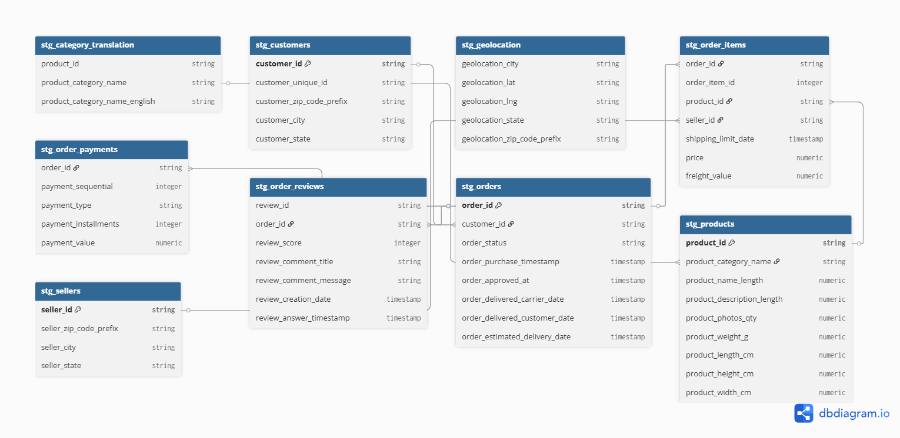
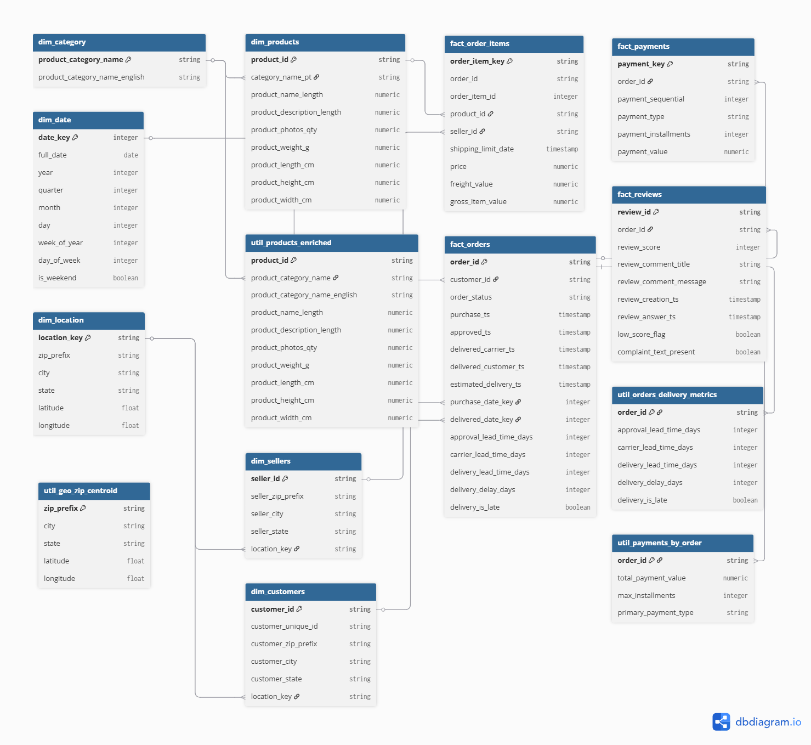

### 1. Run dbt Transformations

After data is loaded into BigQuery, navigate to the dbt project and run transformations:

```bash
cd brazillian_ecommerce_project
```

Run **dbt clean** to clean any existing dependencies

```bash
dbt clean
```
Run **dbt deps** to install packages from packages.yml

```bash
dbt deps
```
Run **dbt run** to materializes dbt models (tables, views) 

```bash
dbt run
```
Run **dbt test** to executes the data quality tests defined in the dbt project

```bash
dbt test
```

### 2. Staging layer
SQL place in "\models\staging\"
SQL with prefix "stg_"

- Standardize naming
- Cast types
- Trim strings
- Basic null handling
- city/state/category → trim + upper/lower standardization (consistent choice)


### 3. Marts
SQL place in "\models\marts\"
SQL with prefix "dim_", "fact_", "util_"

Business logic + final star schema
- All joins, aggregations, derived metrics
- Conformed dimensions
- Fact grains locked and documented

### 4. Utility Marts
- To avoid repeating logic
- Not an intermediate layer — they are marts, consumed by final dims/facts.

### 5. Database Schema

#### Staging
\models\staging\
- stg_category_translation.sql
- stg_customers.sql
- stg_geolocation.sql
- stg_order_items.sql
- stg_order_payments.sql
- stg_order_reviews.sql
- stg_orders.sql
- stg_products.sql
- stg_sellers.sql




#### Dim
\models\marts\
- dim_category.sql
- dim_customers.sql
- dim_date.sql
- dim_location.sql
- dim_products.sql
- dim_sellers
#### Fact
\models\marts\
- fact_order_items.sql
- fact_orders.sql
- fact_payments.sql
- fact_reviews.sql
#### Util
\models\marts\
- util_geo_zip_centroid.sql
- util_orders_delivery_metrics.sql
- util_payments_by_order.sql
- util_products_enriched.sql


